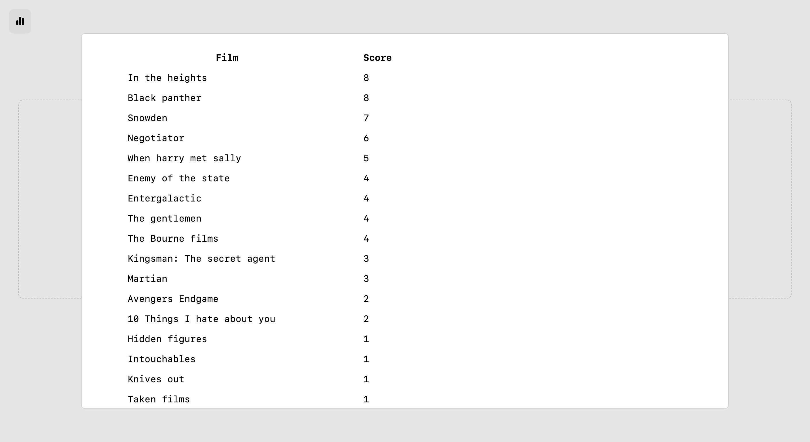

# films-elo

This is a very simple project that ranks films with the Elo rating system (how many comparisons a film wins)

I built this because I had a list of my favourite films, but couldn't decide on the order. I thought it would be in-line with my interests to over-engineer a solution to that problem, and we have this.

## fetures

- Progress counter
- Table of films with their Elo rating, that updates as you rank films

## screenshots

the main page:

the ranked table of films:

## usage

Currently, the only way to use this is to clone the repository, and edit the `index.js` file, which contains a hard-coded list of films.

I am working on a way to add a list of whatever items you want without having to edit the code.

## to-do

- [ ] Add a way to add a list of items without editing the code
- [ ] Save progress and the results to supabase
