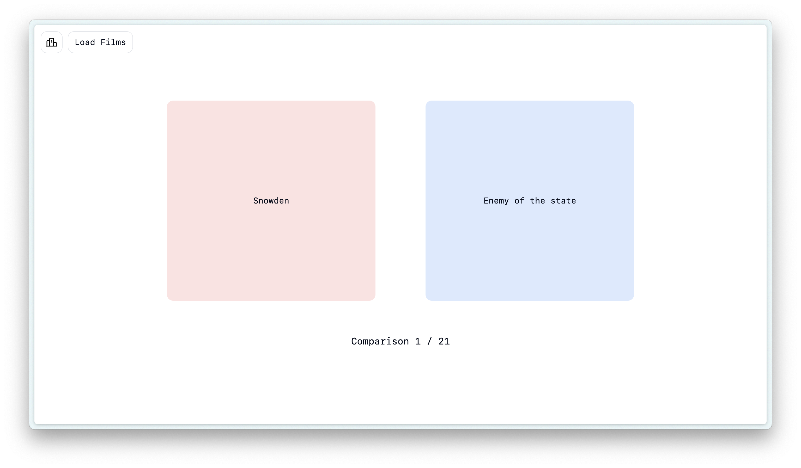
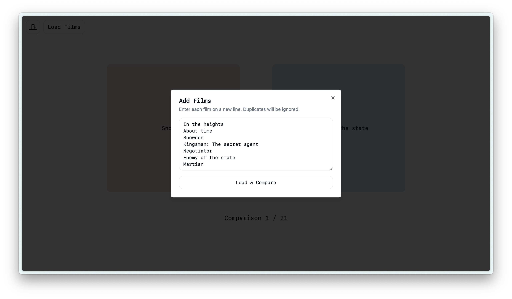
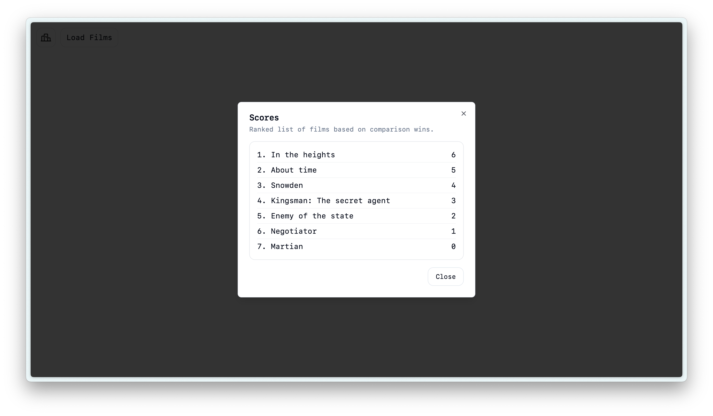

# Films-elo

> web app built with Svelte 5, TypeScript, Tailwind, shadcn/ui-svelte to rank films with an elo-like system

I built this because I had a list of my favourite films, but couldn't decide on the order. I thought it would be in-line with my interests to over-engineer a solution to that problem, and we have this.

### Features

- Add your own films to compare
- Save progress in localstorage

### Preview

### License

This project is licensed under the MIT License - see the [LICENSE](LICENSE) file for details
